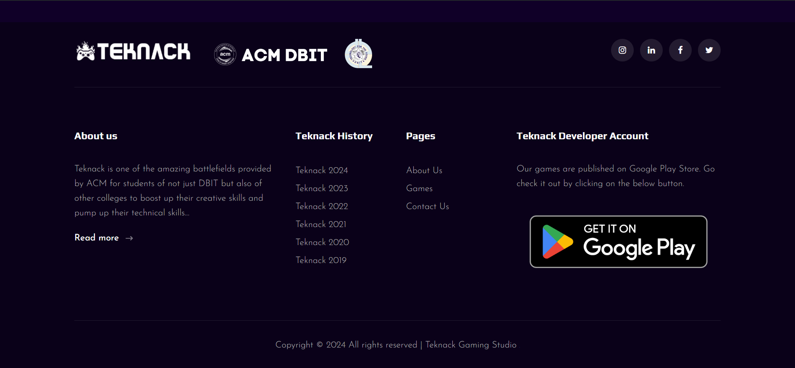
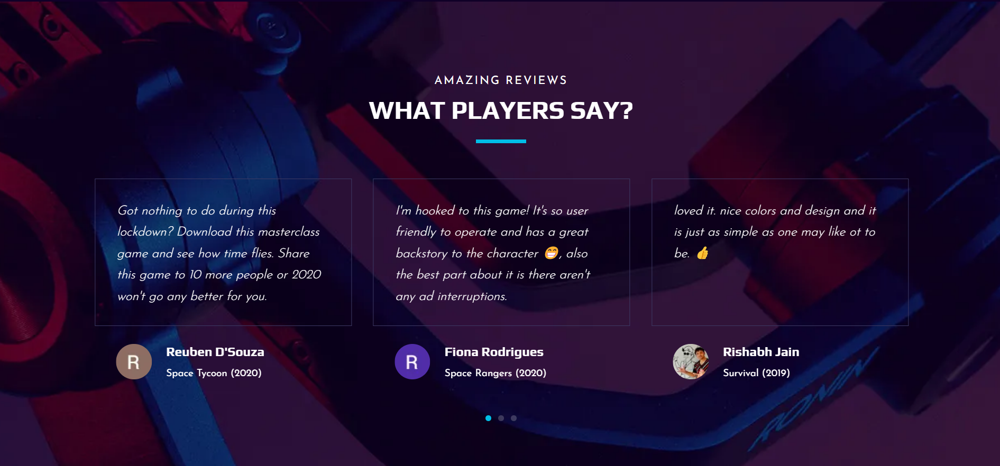
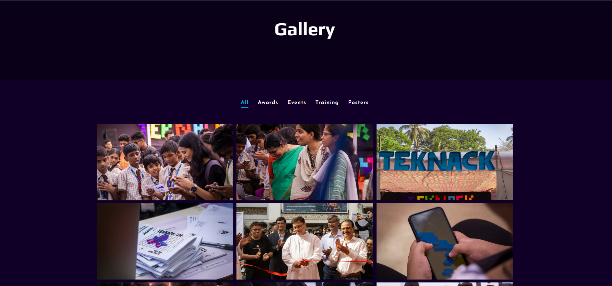

# Teknack Website


## Table of contents

- [Teknack](#teknack-website)
  - [Table of contents](#table-of-contents)
  - [Overview](#overview)
      - [Teknack - ACM DBIT](#teknack---acm-dbit)
    - [Screenshots](#screenshots)
  - [Getting Started  ](#getting-started--)
      - [Step 1](#step-1)
      - [Step 2](#step-2)
  - [Contributions ](#contributions-)
  - [Contributors ](#contributors-)

## Overview

#### Teknack - ACM DBIT

ACM-DBIT chapter took birth in the year 2003 and is in its 20th year of enhancing Dbitians' lives by providing a platform to enjoy learning. Teknack is one of the amazing battlefields provided by ACM for students of not just DBIT but also of other colleges to boost up their creative skills and pump up their technical skills by amalgamating with newer ideas and facts to build up Games that give the players an experience that would last with them forever.

## Screenshots

 <br>

 

## Getting Started  <a id="gettingstarted"></a>

#### Step 1

Download or clone this repository by using the command given below:

```
git clone https://github.com/flockflair-dbit/teknack-website
```

#### Step 2

Go to project root and run the command below

```
npm install or yarn install
npm run dev
```

## Contributions <a id="contributions"></a>


## Contributors <a id="contributors"></a>
  - [Grejo Joby](https://grejo.in/)<br> 
  [](https://www.linkedin.com/in/grejojoby)
  [](https://github.com/grejojoby)
  - [Hayden Cordeiro](https://hayden.co.in/)<br>
  [](https://www.linkedin.com/in/haydencordeiro/)
  [](https://github.com/haydencordeiro)
  - [Siddharth Dhaigude](https://github.com/sd8capricon)<br>
  [](https://www.linkedin.com/in/sdhaigude)
  [](https://github.com/sd8capricon)
  - [Yashas Khot](https://github.com/yashaskhot)<br>
  [](https://www.linkedin.com/in/yashaskhot)
  [](https://github.com/yashaskhot)

