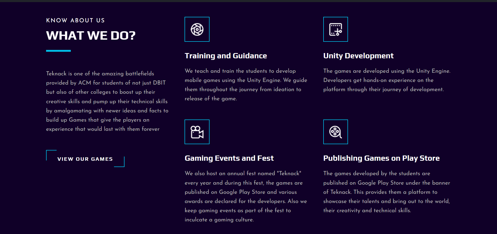

# Teknack Website


## Table of contents

- [Teknack](#teknack-website)
  - [Table of contents](#table-of-contents)
  - [Overview](#overview)
      - [Teknack - ACM DBIT](#teknack---acm-dbit)
    - [Screenshots](#screenshots)
  - [Getting Started  ](#getting-started--)
      - [Step 1](#step-1)
      - [Step 2](#step-2)
  - [Contributions ](#contributions-)
  - [Contributors ](#contributors-)

## Overview

#### Teknack - ACM DBIT

Teknack is one of the amazing battlefields provided by ACM for students of not just DBIT but also of other colleges to boost up their creative skills and pump up their technical skills by integrating with new ideas and facts to build up Games that give the players an experience that would last with them forever.

## What we Do?

- Training and Guidance
    - We teach and train the students to develop mobile games using the Unity Engine. We guide them throughout the journey from ideation to release of the game.
      
- Unity Development
    - The games are developed using the Unity Engine. Developers gain hands-on experience on the platform through their journey of development.
      
- Gaming Events and Fest
    - We also host an annual fest named "Teknack" and during this fest, the games are published on Google Play Store and various awards are declared for the 
      developers.
    -  Additionally, we organize gaming events as part of the festival to foster a gaming culture.
  
- Publishing Games on Play Store
    - The games developed by the students are published on Google Play Store under the banner of Teknack.
    - This provides them with a platform to showcase their talents and bring out to the world, their creativity and technical skills.

## Screenshots

 <br>


 

## Getting Started  <a id="getting-started"></a>

#### Step 1

Download or clone this repository by using the command given below:

```
git clone https://github.com/teknackgaming/teknack-website
```

#### Step 2

Go to project root and run the command below

```
npm install or yarn install
npm run dev
```

## Contributors <a id="contributors"></a>
  - [Grejo Joby](https://grejo.in/)<br> 
  [](https://www.linkedin.com/in/grejojoby)
  [](https://github.com/grejojoby)
  - [Hayden Cordeiro](https://hayden.co.in/)<br>
  [](https://www.linkedin.com/in/haydencordeiro/)
  [](https://github.com/haydencordeiro)
  - [Siddharth Dhaigude](https://github.com/sd8capricon)<br>
  [](https://www.linkedin.com/in/sdhaigude)
  [](https://github.com/sd8capricon)
  - [Yashas Khot](https://github.com/yashaskhot)<br>
  [](https://www.linkedin.com/in/yashaskhot)
  [](https://github.com/yashaskhot)

